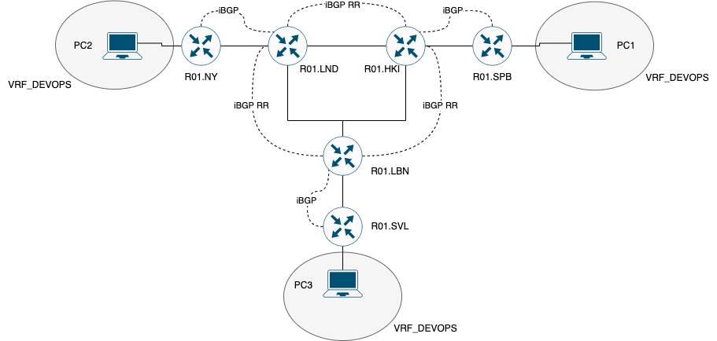

# Лабораторная работа №3

## Общая информация

University: [ITMO University](https://itmo.ru/ru/)
Faculty: [FICT](https://fict.itmo.ru)
Course: [Introduction in routing](https://github.com/itmo-ict-faculty/introduction-in-routing)
Year: 2025/2026
Group: K3320
Author: Rodionov Anatoliy Alexandrovich
Lab: Lab4
Date of create: 08.02.2026
Date of finished: 13.02.2026

## Задание

<https://itmo-ict-faculty.github.io/introduction-in-routing/education/labs2023_2024/lab4/lab4/>

### Схема сети



### Част 1

#### Топология

```
anantoliy@anantoliy-RLEF-XX:~/Desktop/Routing/2025_2026-introduction_in_routing-k3320-Rodionov_A_A/lab4$ cat lab4_part1.yaml 
name: lab4_part1
mgmt:
  network: custom_mgmt
  ipv4-subnet: 172.16.16.0/24

topology:
  nodes:
    R01.SPB:
      kind: vr-mikrotik_ros
      image: vrnetlab/mikrotik_routeros:6.47.9
      mgmt-ipv4: 172.16.16.101
      startup-config: config/part1/R01.SPB.rsc
    R01.HKI:
      kind: vr-mikrotik_ros
      image: vrnetlab/mikrotik_routeros:6.47.9
      mgmt-ipv4: 172.16.16.102
      startup-config: config/part1/R01.HKI.rsc
    R01.SVL:
      kind: vr-mikrotik_ros
      image: vrnetlab/mikrotik_routeros:6.47.9
      mgmt-ipv4: 172.16.16.103
      startup-config: config/part1/R01.SVL.rsc
    R01.LND:
      kind: vr-mikrotik_ros
      image: vrnetlab/mikrotik_routeros:6.47.9
      mgmt-ipv4: 172.16.16.104
      startup-config: config/part1/R01.LND.rsc
    R01.LBN:
      kind: vr-mikrotik_ros
      image: vrnetlab/mikrotik_routeros:6.47.9
      mgmt-ipv4: 172.16.16.105
      startup-config: config/part1/R01.LBN.rsc
    R01.NY:
      kind: vr-mikrotik_ros
      image: vrnetlab/mikrotik_routeros:6.47.9
      mgmt-ipv4: 172.16.16.106
      startup-config: config/part1/R01.NY.rsc
    PC1:
      kind: linux
      image: alpine:latest
      mgmt-ipv4: 172.16.16.2
      binds:
        - ./config:/config
      exec:
        - sh /config/pc.sh
    PC2:
      kind: linux
      image: alpine:latest
      mgmt-ipv4: 172.16.16.3
      binds:
        - ./config:/config
      exec:
        - sh /config/pc.sh
    PC3:
      kind: linux
      image: alpine:latest
      mgmt-ipv4: 172.16.16.4
      binds:
        - ./config:/config
      exec:
        - sh /config/pc.sh


  links:
    - endpoints: ["R01.SPB:eth1","R01.HKI:eth1"]
    - endpoints: ["R01.NY:eth1","R01.LND:eth1"]
    - endpoints: ["R01.SVL:eth1","R01.LBN:eth1"]
    - endpoints: ["R01.HKI:eth2","R01.LND:eth3"]
    - endpoints: ["R01.HKI:eth3","R01.LBN:eth2"]
    - endpoints: ["R01.LND:eth2","R01.LBN:eth3"]
    - endpoints: ["R01.SPB:eth2","PC1:eth1"]
    - endpoints: ["R01.NY:eth2","PC2:eth1"]
    - endpoints: ["R01.SVL:eth2","PC3:eth1"]
```

#### Деплой

```
anantoliy@anantoliy-RLEF-XX:~/Desktop/Routing/2025_2026-introduction_in_routing-k3320-Rodionov_A_A/lab4$ sudo containerlab deploy -t lab4_part1.yaml
02:01:39 INFO Containerlab started version=0.72.0
02:01:39 INFO Parsing & checking topology file=lab4_part1.yaml
02:01:39 INFO Creating docker network name=custom_mgmt IPv4 subnet=172.16.16.0/24 IPv6 subnet="" MTU=0
02:01:40 INFO Creating lab directory path=/home/anantoliy/Desktop/Routing/2025_2026-introduction_in_routing-k3320-Rodionov_A_A/lab4/clab-lab4_part1
02:01:41 INFO Creating container name=PC2
02:01:41 INFO Creating container name=PC3
02:01:41 INFO Creating container name=PC1
02:01:41 INFO Creating container name=R01.HKI
02:01:41 INFO Creating container name=R01.LBN
02:01:41 INFO Creating container name=R01.NY
02:01:41 INFO Creating container name=R01.LND
02:01:41 INFO Creating container name=R01.SPB
02:01:41 INFO Creating container name=R01.SVL
02:01:41 INFO Created link: R01.NY:eth1 ▪┄┄▪ R01.LND:eth1
02:01:41 INFO Created link: R01.NY:eth2 ▪┄┄▪ PC2:eth1
02:01:42 INFO Created link: R01.SPB:eth2 ▪┄┄▪ PC1:eth1
02:01:42 INFO Created link: R01.SVL:eth2 ▪┄┄▪ PC3:eth1
02:01:42 INFO Created link: R01.SVL:eth1 ▪┄┄▪ R01.LBN:eth1
02:01:42 INFO Created link: R01.SPB:eth1 ▪┄┄▪ R01.HKI:eth1
02:01:42 INFO Created link: R01.HKI:eth2 ▪┄┄▪ R01.LND:eth3
02:01:42 INFO Created link: R01.LND:eth2 ▪┄┄▪ R01.LBN:eth3
02:01:42 INFO Created link: R01.HKI:eth3 ▪┄┄▪ R01.LBN:eth2
02:02:52 INFO Executed command node=PC2 command="sh /config/pc.sh" stdout=""
02:02:52 INFO Executed command node=PC1 command="sh /config/pc.sh" stdout=""
02:02:52 INFO Executed command node=PC3 command="sh /config/pc.sh" stdout=""
02:02:52 INFO Adding host entries path=/etc/hosts
02:02:52 INFO Adding SSH config for nodes path=/etc/ssh/ssh_config.d/clab-lab4_part1.conf
02:02:52 INFO containerlab version
  🎉=
  │ A newer containerlab version (0.73.0) is available!
  │ Release notes: https://containerlab.dev/rn/0.73/
  │ Run 'clab version upgrade' or see https://containerlab.dev/install/ for other installation options.
╭─────────────────────────┬───────────────────────────────────┬───────────┬────────────────╮
│           Name          │             Kind/Image            │   State   │ IPv4/6 Address │
├─────────────────────────┼───────────────────────────────────┼───────────┼────────────────┤
│ clab-lab4_part1-PC1     │ linux                             │ running   │ 172.16.16.2    │
│                         │ alpine:latest                     │           │ N/A            │
├─────────────────────────┼───────────────────────────────────┼───────────┼────────────────┤
│ clab-lab4_part1-PC2     │ linux                             │ running   │ 172.16.16.3    │
│                         │ alpine:latest                     │           │ N/A            │
├─────────────────────────┼───────────────────────────────────┼───────────┼────────────────┤
│ clab-lab4_part1-PC3     │ linux                             │ running   │ 172.16.16.4    │
│                         │ alpine:latest                     │           │ N/A            │
├─────────────────────────┼───────────────────────────────────┼───────────┼────────────────┤
│ clab-lab4_part1-R01.HKI │ vr-mikrotik_ros                   │ running   │ 172.16.16.102  │
│                         │ vrnetlab/mikrotik_routeros:6.47.9 │ (healthy) │ N/A            │
├─────────────────────────┼───────────────────────────────────┼───────────┼────────────────┤
│ clab-lab4_part1-R01.LBN │ vr-mikrotik_ros                   │ running   │ 172.16.16.105  │
│                         │ vrnetlab/mikrotik_routeros:6.47.9 │ (healthy) │ N/A            │
├─────────────────────────┼───────────────────────────────────┼───────────┼────────────────┤
│ clab-lab4_part1-R01.LND │ vr-mikrotik_ros                   │ running   │ 172.16.16.104  │
│                         │ vrnetlab/mikrotik_routeros:6.47.9 │ (healthy) │ N/A            │
├─────────────────────────┼───────────────────────────────────┼───────────┼────────────────┤
│ clab-lab4_part1-R01.NY  │ vr-mikrotik_ros                   │ running   │ 172.16.16.106  │
│                         │ vrnetlab/mikrotik_routeros:6.47.9 │ (healthy) │ N/A            │
├─────────────────────────┼───────────────────────────────────┼───────────┼────────────────┤
│ clab-lab4_part1-R01.SPB │ vr-mikrotik_ros                   │ running   │ 172.16.16.101  │
│                         │ vrnetlab/mikrotik_routeros:6.47.9 │ (healthy) │ N/A            │
├─────────────────────────┼───────────────────────────────────┼───────────┼────────────────┤
│ clab-lab4_part1-R01.SVL │ vr-mikrotik_ros                   │ running   │ 172.16.16.103  │
│                         │ vrnetlab/mikrotik_routeros:6.47.9 │ (healthy) │ N/A            │
╰─────────────────────────┴───────────────────────────────────┴───────────┴────────────────╯

```

#### Тест

Пинг с PC1 на PC2

```
/ # ping -c 3 172.16.16.3
PING 172.16.16.3 (172.16.16.3): 56 data bytes
64 bytes from 172.16.16.3: seq=0 ttl=64 time=0.244 ms
64 bytes from 172.16.16.3: seq=1 ttl=64 time=0.135 ms
64 bytes from 172.16.16.3: seq=2 ttl=64 time=0.152 ms

--- 172.16.16.3 ping statistics ---
3 packets transmitted, 3 packets received, 0% packet loss
round-trip min/avg/max = 0.135/0.177/0.244 ms
```

Пинг с PC1 на PC3

```
/ # ping -c 3 172.16.16.4
PING 172.16.16.4 (172.16.16.4): 56 data bytes
64 bytes from 172.16.16.4: seq=0 ttl=64 time=0.276 ms
64 bytes from 172.16.16.4: seq=1 ttl=64 time=0.171 ms
64 bytes from 172.16.16.4: seq=2 ttl=64 time=0.141 ms

--- 172.16.16.4 ping statistics ---
3 packets transmitted, 3 packets received, 0% packet loss
round-trip min/avg/max = 0.141/0.196/0.276 ms
```

Работа OSPF:

```
[panindv@R01.SPB] > ip route print 
Flags: X - disabled, A - active, D - dynamic, C - connect, S - static, r - rip, b - bgp, o - ospf, m - mme, B - blackhole, U - unreachable, P - prohibit 
 #      DST-ADDRESS        PREF-SRC        GATEWAY            DISTANCE
 0 ADC  10.100.1.1/32      10.100.1.1      br100                     0
 1 ADb  10.100.1.2/32                      10.255.255.6            200
 2 ADb  10.100.1.3/32                      10.255.255.3            200
 3 ADC  10.20.1.0/30       10.20.1.1       ether2                    0
 4 ADo  10.20.2.0/30                       10.20.1.2               110
 5 ADo  10.20.3.0/30                       10.20.1.2               110
 6 ADo  10.20.11.0/30                      10.20.1.2               110
 7 ADo  10.20.12.0/30                      10.20.1.2               110
 8 ADo  10.20.13.0/30                      10.20.1.2               110
 9 ADC  10.255.255.1/32    10.255.255.1    loopback                  0
10 ADo  10.255.255.2/32                    10.20.1.2               110
11 ADo  10.255.255.3/32                    10.20.1.2               110
12 ADo  10.255.255.4/32                    10.20.1.2               110
13 ADo  10.255.255.5/32                    10.20.1.2               110
14 ADo  10.255.255.6/32                    10.20.1.2               110
15 ADC  172.31.255.28/30   172.31.255.30   ether1                    0
16 ADC  192.168.10.0/24    192.168.10.1    ether3                    0
17 ADo  192.168.11.0/24                    10.20.1.2               110
18 ADo  192.168.12.0/24                    10.20.1.2               110
```

Работы MPLS:

```
[panindv@R01.SPB] > mpls forwarding-table print 
Flags: H - hw-offload, L - ldp, V - vpls, T - traffic-eng 
 #    IN-LABEL                                      OUT-LABELS                                   DESTINATION                    INTERFACE                                   NEXTHOP        
 0    expl-null                                    
 1    16                                                                                         10.100.1.1/32@VRF_DEVOPS      
 2  L 17                                            16                                           10.255.255.5/32                ether2                                      10.20.1.2      
 3  L 18                                            18                                           192.168.11.0/24                ether2                                      10.20.1.2      
 4  L 19                                                                                         10.20.12.0/30                  ether2                                      10.20.1.2      
 5  L 20                                            21                                           10.20.13.0/30                  ether2                                      10.20.1.2      
 6  L 21                                            17                                           10.255.255.6/32                ether2                                      10.20.1.2      
 7  L 22                                            20                                           10.255.255.4/32                ether2                                      10.20.1.2      
 8  L 23                                                                                         10.255.255.2/32                ether2                                      10.20.1.2      
 9  L 24                                                                                         10.20.11.0/30                  ether2                                      10.20.1.2      
10  L 25                                            22                                           10.20.2.0/30                   ether2                                      10.20.1.2      
11  L 26                                            26                                           192.168.12.0/24                ether2                                      10.20.1.2      
12  L 27                                            24                                           10.255.255.3/32                ether2                                      10.20.1.2      
13  L 28                                            19                                           10.20.3.0/30                   ether2                                      10.20.1.2
```

Работа iBGP:

```
[panindv@R01.SPB] > ip route print where bgp
Flags: X - disabled, A - active, D - dynamic, C - connect, S - static, r - rip, b - bgp, o - ospf, m - mme, B - blackhole, U - unreachable, P - prohibit 
 #      DST-ADDRESS        PREF-SRC        GATEWAY            DISTANCE
 0 ADb  10.100.1.2/32                      10.255.255.6            200
 1 ADb  10.100.1.3/32                      10.255.255.3            200
```

VRF:

```
[panindv@R01.SPB] > ip route print where routing-mark=VRF_DEVOPS
Flags: X - disabled, A - active, D - dynamic, C - connect, S - static, r - rip, b - bgp, o - ospf, m - mme, B - blackhole, U - unreachable, P - prohibit 
 #      DST-ADDRESS        PREF-SRC        GATEWAY            DISTANCE
 0 ADC  10.100.1.1/32      10.100.1.1      br100                     0
 1 ADb  10.100.1.2/32                      10.255.255.6            200
 2 ADb  10.100.1.3/32                      10.255.255.3            200
```

Связность между VRF:

```
[panindv@R01.SPB] > ping 10.100.1.2 routing-table=VRF_DEVOPS src-address=10.100.1.1 c=3
  SEQ HOST                                     SIZE TTL TIME  STATUS                                                                                                                       
    0 10.100.1.2                                 56  62 1ms  
    1 10.100.1.2                                 56  62 1ms  
    2 10.100.1.2                                 56  62 1ms  
    sent=3 received=3 packet-loss=0% min-rtt=1ms avg-rtt=1ms max-rtt=1ms 
```


### Часть 2

#### Топология

```
anantoliy@anantoliy-RLEF-XX:~/Desktop/Routing/2025_2026-introduction_in_routing-k3320-Rodionov_A_A/lab4$ cat lab4_part2.yaml 
name: lab4_part2
mgmt:
  network: custom_mgmt-part2
  ipv4-subnet: 172.16.18.0/24

topology:
  nodes:
    R01.SPB:
      kind: vr-mikrotik_ros
      image: vrnetlab/mikrotik_routeros:6.47.9
      mgmt-ipv4: 172.16.18.101
      startup-config: config/part2/R01.SPB.rsc
    R01.HKI:
      kind: vr-mikrotik_ros
      image: vrnetlab/mikrotik_routeros:6.47.9
      mgmt-ipv4: 172.16.18.102
      startup-config: config/part2/R01.HKI.rsc
    R01.SVL:
      kind: vr-mikrotik_ros
      image: vrnetlab/mikrotik_routeros:6.47.9
      mgmt-ipv4: 172.16.18.103
      startup-config: config/part2/R01.SVL.rsc
    R01.LND:
      kind: vr-mikrotik_ros
      image: vrnetlab/mikrotik_routeros:6.47.9
      mgmt-ipv4: 172.16.18.104
      startup-config: config/part2/R01.LND.rsc
    R01.LBN:
      kind: vr-mikrotik_ros
      image: vrnetlab/mikrotik_routeros:6.47.9
      mgmt-ipv4: 172.16.18.105
      startup-config: config/part2/R01.LBN.rsc
    R01.NY:
      kind: vr-mikrotik_ros
      image: vrnetlab/mikrotik_routeros:6.47.9
      mgmt-ipv4: 172.16.18.106
      startup-config: config/part2/R01.NY.rsc
    PC1:
      kind: linux
      image: alpine:latest
      mgmt-ipv4: 172.16.18.2
      binds:
        - ./config:/config
      exec:
        - sh /config/pc.sh
    PC2:
      kind: linux
      image: alpine:latest
      mgmt-ipv4: 172.16.18.3
      binds:
        - ./config:/config
      exec:
        - sh /config/pc.sh
    PC3:
      kind: linux
      image: alpine:latest
      mgmt-ipv4: 172.16.18.4
      binds:
        - ./config:/config
      exec:
        - sh /config/pc.sh


  links:
    - endpoints: ["R01.SPB:eth1","R01.HKI:eth1"]
    - endpoints: ["R01.NY:eth1","R01.LND:eth1"]
    - endpoints: ["R01.SVL:eth1","R01.LBN:eth1"]
    - endpoints: ["R01.HKI:eth2","R01.LND:eth3"]
    - endpoints: ["R01.HKI:eth3","R01.LBN:eth2"]
    - endpoints: ["R01.LND:eth2","R01.LBN:eth3"]
    - endpoints: ["R01.SPB:eth2","PC1:eth1"]
    - endpoints: ["R01.NY:eth2","PC2:eth1"]
    - endpoints: ["R01.SVL:eth2","PC3:eth1"]
    

```

#### Деплой

```
anantoliy@anantoliy-RLEF-XX:~/Desktop/Routing/2025_2026-introduction_in_routing-k3320-Rodionov_A_A/lab4$ sudo containerlab deploy -t lab4_part2.yaml
02:13:18 INFO Containerlab started version=0.72.0
02:13:18 INFO Parsing & checking topology file=lab4_part2.yaml
02:13:18 INFO Creating docker network name=custom_mgmt-part2 IPv4 subnet=172.16.18.0/24 IPv6 subnet="" MTU=0
02:13:18 INFO Creating lab directory path=/home/anantoliy/Desktop/Routing/2025_2026-introduction_in_routing-k3320-Rodionov_A_A/lab4/clab-lab4_part2
02:13:18 INFO Creating container name=PC3
02:13:18 INFO Creating container name=PC2
02:13:18 INFO Creating container name=PC1
02:13:18 INFO Creating container name=R01.HKI
02:13:18 INFO Creating container name=R01.LBN
02:13:18 INFO Creating container name=R01.SPB
02:13:18 INFO Creating container name=R01.NY
02:13:18 INFO Creating container name=R01.LND
02:13:18 INFO Creating container name=R01.SVL
02:13:19 INFO Created link: R01.SPB:eth1 ▪┄┄▪ R01.HKI:eth1
02:13:19 INFO Created link: R01.NY:eth2 ▪┄┄▪ PC2:eth1
02:13:19 INFO Created link: R01.SPB:eth2 ▪┄┄▪ PC1:eth1
02:13:19 INFO Created link: R01.SVL:eth1 ▪┄┄▪ R01.LBN:eth1
02:13:19 INFO Created link: R01.HKI:eth3 ▪┄┄▪ R01.LBN:eth2
02:13:19 INFO Created link: R01.NY:eth1 ▪┄┄▪ R01.LND:eth1
02:13:19 INFO Created link: R01.SVL:eth2 ▪┄┄▪ PC3:eth1
02:13:19 INFO Created link: R01.HKI:eth2 ▪┄┄▪ R01.LND:eth3
02:13:19 INFO Created link: R01.LND:eth2 ▪┄┄▪ R01.LBN:eth3
02:15:40 INFO Executed command node=PC1 command="sh /config/pc.sh" stdout=""
02:15:40 INFO Executed command node=PC3 command="sh /config/pc.sh" stdout=""
02:15:40 INFO Executed command node=PC2 command="sh /config/pc.sh" stdout=""
02:15:40 INFO Adding host entries path=/etc/hosts
02:15:40 INFO Adding SSH config for nodes path=/etc/ssh/ssh_config.d/clab-lab4_part2.conf
02:15:41 INFO containerlab version
  🎉=
  │ A newer containerlab version (0.73.0) is available!
  │ Release notes: https://containerlab.dev/rn/0.73/
  │ Run 'clab version upgrade' or see https://containerlab.dev/install/ for other installation options.
╭─────────────────────────┬───────────────────────────────────┬───────────┬────────────────╮
│           Name          │             Kind/Image            │   State   │ IPv4/6 Address │
├─────────────────────────┼───────────────────────────────────┼───────────┼────────────────┤
│ clab-lab4_part2-PC1     │ linux                             │ running   │ 172.16.18.2    │
│                         │ alpine:latest                     │           │ N/A            │
├─────────────────────────┼───────────────────────────────────┼───────────┼────────────────┤
│ clab-lab4_part2-PC2     │ linux                             │ running   │ 172.16.18.3    │
│                         │ alpine:latest                     │           │ N/A            │
├─────────────────────────┼───────────────────────────────────┼───────────┼────────────────┤
│ clab-lab4_part2-PC3     │ linux                             │ running   │ 172.16.18.4    │
│                         │ alpine:latest                     │           │ N/A            │
├─────────────────────────┼───────────────────────────────────┼───────────┼────────────────┤
│ clab-lab4_part2-R01.HKI │ vr-mikrotik_ros                   │ running   │ 172.16.18.102  │
│                         │ vrnetlab/mikrotik_routeros:6.47.9 │ (healthy) │ N/A            │
├─────────────────────────┼───────────────────────────────────┼───────────┼────────────────┤
│ clab-lab4_part2-R01.LBN │ vr-mikrotik_ros                   │ running   │ 172.16.18.105  │
│                         │ vrnetlab/mikrotik_routeros:6.47.9 │ (healthy) │ N/A            │
├─────────────────────────┼───────────────────────────────────┼───────────┼────────────────┤
│ clab-lab4_part2-R01.LND │ vr-mikrotik_ros                   │ running   │ 172.16.18.104  │
│                         │ vrnetlab/mikrotik_routeros:6.47.9 │ (healthy) │ N/A            │
├─────────────────────────┼───────────────────────────────────┼───────────┼────────────────┤
│ clab-lab4_part2-R01.NY  │ vr-mikrotik_ros                   │ running   │ 172.16.18.106  │
│                         │ vrnetlab/mikrotik_routeros:6.47.9 │ (healthy) │ N/A            │
├─────────────────────────┼───────────────────────────────────┼───────────┼────────────────┤
│ clab-lab4_part2-R01.SPB │ vr-mikrotik_ros                   │ running   │ 172.16.18.101  │
│                         │ vrnetlab/mikrotik_routeros:6.47.9 │ (healthy) │ N/A            │
├─────────────────────────┼───────────────────────────────────┼───────────┼────────────────┤
│ clab-lab4_part2-R01.SVL │ vr-mikrotik_ros                   │ running   │ 172.16.18.103  │
│                         │ vrnetlab/mikrotik_routeros:6.47.9 │ (healthy) │ N/A            │
╰─────────────────────────┴───────────────────────────────────┴───────────┴────────────────╯

```

#### Тест

Выдача ip:

```
[panindv@R01.SPB] > ip dhcp-server lease print 
Flags: X - disabled, R - radius, D - dynamic, B - blocked 
 #   ADDRESS                             MAC-ADDRESS       HOST-NAME                   SERVER                   RATE-LIMIT                   STATUS  LAST-SEEN                             
 0 D 10.100.1.254                        AA:C1:AB:BF:EA:D6                             dhcp-vpls                                             bound   1m23s                                 
 1 D 10.100.1.253                        AA:C1:AB:01:7D:D0                             dhcp-vpls                                             bound   40s                                   
 2 D 10.100.1.252                        AA:C1:AB:3C:4A:11                             dhcp-vpls                                             bound   35s      
```

Пинг с PC1 на PC2:

```
/ # ping -c 3 10.100.1.252
PING 10.100.1.252 (10.100.1.252): 56 data bytes
64 bytes from 10.100.1.252: seq=0 ttl=64 time=3.825 ms
64 bytes from 10.100.1.252: seq=1 ttl=64 time=2.552 ms
64 bytes from 10.100.1.252: seq=2 ttl=64 time=2.626 ms

--- 10.100.1.252 ping statistics ---
3 packets transmitted, 3 packets received, 0% packet loss
round-trip min/avg/max = 2.552/3.001/3.825 ms
```

Пинг с PC1 на PC3:

```
/ # ping -c 3 10.100.1.253
PING 10.100.1.253 (10.100.1.253): 56 data bytes
64 bytes from 10.100.1.253: seq=0 ttl=64 time=5.977 ms
64 bytes from 10.100.1.253: seq=1 ttl=64 time=3.922 ms
64 bytes from 10.100.1.253: seq=2 ttl=64 time=3.689 ms

--- 10.100.1.253 ping statistics ---
3 packets transmitted, 3 packets received, 0% packet loss
round-trip min/avg/max = 3.689/4.529/5.977 ms
```
